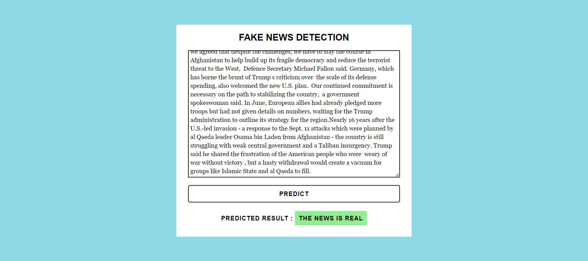

# Fake News Detection

This project aims to detect fake news using machine learning techniques.

## Dataset
The dataset used for this project can be found on Kaggle: [Fake News Detection Datasets](https://www.kaggle.com/datasets/emineyetm/fake-news-detection-datasets)

## Model
The model for fake news detection is based on logistic regression.

## Interface Streamlit

## Interface React

